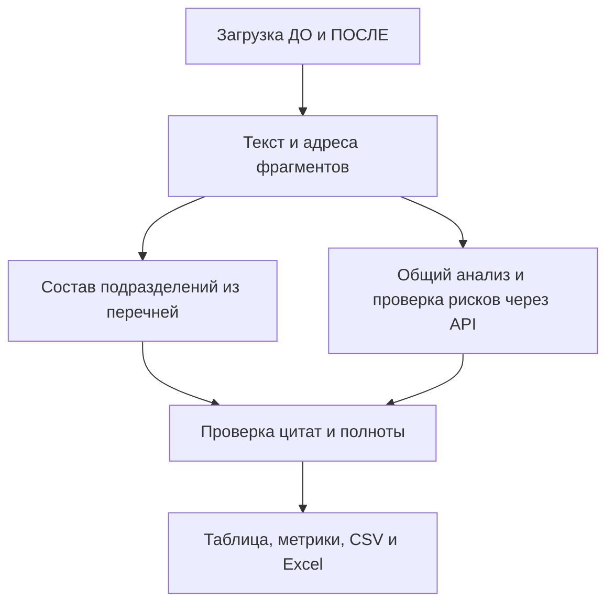

# ИИ агент анализа организационной структуры — Казахтелеком

Прототип сопоставляет **любые подходящие комплекты документов одной организации**: **ДО** и **ПОСЛЕ** реорганизации. Он извлекает текст, передает его выбранной модели OpenAI, проверяет ссылки в структурированном ответе и показывает изменения подразделений, функции и потенциальные риски. Название «Казахтелеком» в заголовке — название проекта; организация и её подразделения берутся только из загруженных файлов. Контрольные редакции №8/№9 служат примером проверки, а не встроенным шаблоном аудита.

Выводы модели рекомендательные. Проверка существования номера пункта не доказывает, что содержание пункта подтверждает сформулированный вывод. Ответственный сотрудник должен сверять выводы с показанными фрагментами и исходными документами.

## Файлы проекта

- `app.py` — Streamlit интерфейс, чтение Word/PDF/Excel, два этапа анализа, проверка источников и выгрузка.
- `excel_ingest.py` — чтение строк `.xlsx` и `.xls` с именами листов и номерами строк.
- `requirements.txt` — зависимости Python.
- `README.md` — запуск, архитектура и контрольный сценарий.
- `test_audit_acceptance.py` — проверка на контрольных редакциях №8/№9 (для запуска нужны сами DOCX).
- `test_generic_documents.py` — независимые примеры других организаций и форматов (файлы создаются самим тестом).

## Установка и запуск

Нужны Python 3.10 или новее, доступ к интернету для вызова OpenAI API и собственный ключ с доступом к выбранной модели. Работа с API может тарифицироваться отдельно от подписки ChatGPT.

### Linux

```bash
cd /путь/к/проекту
python3 -m venv .venv
source .venv/bin/activate
python -m pip install -r requirements.txt
python -m streamlit run app.py
```

### Windows PowerShell

```powershell
cd C:\путь\к\проекту
py -m venv .venv
.venv\Scripts\Activate.ps1
python -m pip install -r requirements.txt
python -m streamlit run app.py
```

Если PowerShell запрещает активацию окружения, команды можно выполнить без неё: `.venv\Scripts\python.exe -m pip install -r requirements.txt` и `.venv\Scripts\python.exe -m streamlit run app.py`.

Откройте адрес **Local URL**, показанный в терминале, обычно `http://localhost:8501`. При первом запуске Streamlit может попросить адрес электронной почты для рассылки: оставьте поле пустым и нажмите Enter. Остановить сервер можно `Ctrl+C`.

Запускайте именно `app.py` из распакованной новой версии проекта. Если в терминале написано `streamlit run app2.py`, остановите прежний процесс (`Ctrl+C`) и выполните `python -m streamlit run app.py` в каталоге проекта.

## Ключ OpenAI API

Есть два способа передать ключ:

1. Ввести его в поле **«Ключ OpenAI API»** в боковой панели приложения.
2. Задать переменную окружения до запуска. Для Linux: `export OPENAI_API_KEY='ваш_ключ'`; для PowerShell: `$env:OPENAI_API_KEY = 'ваш_ключ'`. Затем запустить приложение командами выше.

Ключ можно также задать через Streamlit secrets. Не добавляйте ключ в `app.py`, README или репозиторий и не показывайте его на скриншотах. При запуске аудита извлеченный текст загруженных документов передается в OpenAI API; загружайте только документы, которые разрешено обрабатывать таким способом.

## Основной сценарий

1. Выберите модель `gpt-4o-mini` либо `gpt-4o`.
2. Добавьте документы до реорганизации в **«Комплект документов ДО»**, а новую редакцию — в **«Комплект документов ПОСЛЕ»**. Принимаются `.docx`, текстовые `.pdf`, `.xlsx` и `.xls`. Можно загрузить несколько файлов в каждый комплект.
3. Нажмите **«Запустить аудит»**. Приложение выполнит два запроса к API: общий анализ функций и отдельную проверку потерь, дублирования и конфликтов; находки обоих проходов объединяются. При непроверенном результате оно покажет «—» вместо числа рисков, перечислит строки для ручной проверки и отключит выгрузку.
4. Проверьте изменения подразделений, строки таблицы и показанные фрагменты источников. Метрики показывают число подтвержденных строк со статусами «Утрачена» и «Дублируется», а не доказательство того, что других случаев нет.
5. При полном подтверждении скачайте `audit_comparison.csv` или `audit_report.xlsx`. Уже скачанный файл не обновляется после повторного запуска аудита: скачайте отчет заново.

Для Word без нумерации приложение ссылается на последовательные «Фрагменты», для PDF — на страницу и строку извлечённого текста, для Excel — на имя листа и номер строки. Для PDF, содержащего только изображения страниц, понадобится предварительное OCR с сохранением распознанного текстового слоя. Сложная верстка может изменить порядок извлечения фрагментов, поэтому сверяйте цитаты с оригиналом.

## Что находится в отчете

В интерфейсе изменения подразделений распределены по статусам «Создано», «Реорганизовано», «Сохранено без изменений» и «Упразднено». Таблица функций имеет поля:

| Поле | Содержание |
| --- | --- |
| Функция ДО | Формулировка обязанности до реорганизации |
| Подразделение ДО | Владелец функции в старых документах |
| Статус | Сохранена, Утрачена, Дублируется или Конфликт |
| Функция и подразделение ПОСЛЕ | Соответствующая обязанность и владелец после изменений, либо описание отсутствия обязанности |
| Ссылка на пункт и документ (ДО и ПОСЛЕ) | Имя файла, номер пункта, фрагмент Word, строка страницы PDF либо лист и строка Excel |

В Excel предусмотрены листы **«Сопоставление»**, **«Подразделения»**, **«Заключение»**, **«Источники»** с дословными цитатами. CSV содержит таблицу сопоставления. Рядом с заключением и рекомендациями отображаются источники; по ссылкам в интерфейсе можно перейти к извлеченному фрагменту.

Перенесенная между подразделениями функция считается сохраненной. Метка **«Утрачена»** применяется, когда ответственность явно была в ДО и не найдена в ПОСЛЕ; наличие похожей функции в другом пункте может изменить оценку. Метки **«Дублируется»** и **«Конфликт»** описывают возможный риск и требуют анализа границ ответственности.

## Архитектура



Интерфейс работает на Streamlit. `python-docx`, `pypdf`, `openpyxl` и `xlrd` читают входные документы. Состав явно перечисленных подразделений сравнивается локально, чтобы родительская структура не смешивалась с отделами; когда перечень не распознан, применяется вывод модели с проверкой источников и защитой от явного ложного «упразднено»/«создано». OpenAI API отдельно строит сопоставление функций и ищет потери, дублирование и конфликты. Локальный код проверяет имя документа, адрес фрагмента и дословное совпадение цитаты с извлеченным текстом. `pandas` и `openpyxl` готовят экспорт. Эта проверка не доказывает логическую верность интерпретации или полноту поиска; смысл вывода проверяет сотрудник.

Прототип не обращается к внешним нормативным базам и не сравнивает компанию с другими операторами. Такие проверки в задании помечены как опциональные и потребуют предоставления исходных источников.

## Контрольный сценарий: редакции №8 и №9

Используйте файлы `Положение_о_внутреннем_аудите_редакция_8_обезличено.docx` для ДО и `Положение_о_внутреннем_аудите_редакция_9_обезличено.docx` для ПОСЛЕ. Ниже ориентиры для ручной проверки содержательной корректности результата. Они опираются на текст **«Положения о внутреннем аудите АО „Компания“»** соответствующей редакции.

| Ожидаемое наблюдение | Пункты источников |
| --- | --- |
| Блок внутреннего аудита (БВА) сохраняется; его нельзя называть упраздненным. В составе редакции №9 появляются ДИТААД и ДОА, а ДНМ и ДККМ остаются в перечне. | Ред. №8, п. 3.4; ред. №9, п. 3.4. |
| Общие аудиторские проверки перераспределены по специализации ДИТААД и ДОА; перенос не означает потерю аудиторской функции. | Ред. №8, пп. 5.3.3–5.3.4; ред. №9, пп. 5.3.2, 5.3.4–5.3.5. |
| ДНМ сохраняет название, но использование результатов субъектов СВК и поиск недостаточного или дублирующего покрытия рисков переданы директорам ДИТААД и ДОА. | Ред. №8, п. 5.4.4(а–б); ред. №9, п. 5.3.3(а–б), п. 5.4. |
| В новой редакции нет прежнего **прямого закрепления** контроля сроков выполнения графика проверки за руководителем. Формирование графика остается, поэтому вывод следует формулировать как отсутствие явного владельца контроля сроков, а не доказательство, что сроки вообще не контролируются. | Ред. №8, п. 5.3.4(б); ред. №9, пп. 5.3.4(в), 5.3.5. |
| В редакции №9 анализ результатов непрерывного аудита указан и у директоров ДИТААД/ДОА, и у ДНМ. Это потенциальное пересечение, для которого следует уточнить границу ответственности. | Ред. №9, пп. 5.3.8, 5.4.5; для контекста ред. №8, пп. 5.3.7, 5.4.6, 5.5.4. |
| В редакции №9 директора ДИТААД/ДОА проводят проверки и контролируют качество команды. Это повод проверить независимость последующей оценки; сам по себе операционный контроль работы команды не доказывает нарушение. | Ред. №9, п. 5.3.5(а–в) и п. 5.5.2. |

Критерий демонстрации: приложение должно показать корректные подразделения, хотя бы один обоснованный случай утраты явного закрепления функции и обоснованное пересечение, а каждую строку — связать с существующим пунктом **и соответствующим ему содержанием**. Если модель пропускает эти случаи, относит БВА к упраздненным или скрывает существенные строки, контрольный прогон считается неуспешным и требует доработки или ручной проверки; нулевые метрики нельзя выдавать за подтвержденное отсутствие рисков.

## Ограничения

- Модель может пропустить функцию, неверно интерпретировать ее перенос либо сослаться на существующий, но неподходящий пункт. Нужна содержательная проверка человеком.
- Структурная проверка ссылки подтверждает имя загруженного документа, существование пункта/строки/фрагмента и дословную цитату; смысловую связь вывода и цитаты следует проверять отдельно.
- Извлечение из сканированных PDF без текстового слоя не заменяет OCR. Сложная верстка Word и Excel, объединенные ячейки, нестандартная нумерация и PDF с колонками могут ухудшить извлечение.
- Для определения переноса обязанностей нужны сопоставимые тексты ДО и ПОСЛЕ; на случайных несвязанных файлах достоверный аудит невозможен. Нулевое число выявленных рисков не гарантирует, что их нет.
- Если комплект не помещается в установленный предел входного контекста, разделите документы по тематическим областям, но не объединяйте частичные результаты без проверки пересечений между ними.
- Не используйте отчет как окончательное юридическое, кадровое или аудиторское заключение без проверки специалистом.

## Проверка контрольных случаев

Независимые примеры запускаются без сторонних файлов командой `python -m unittest -v test_generic_documents`. Для проверки редакций №8 и №9 положите их с именами из раздела «Контрольный сценарий» в папку `upload` и выполните `python -m unittest -v test_audit_acceptance`. Если файлы расположены отдельно, укажите пути через `TEST_BEFORE_DOCX` и `TEST_AFTER_DOCX`. Тесты проверяют обработку файлов и локальные ограничения; для проверки качества ответов модели проведите полный запуск через интерфейс с вашим API-ключом и сопоставьте результат с исходными документами.
